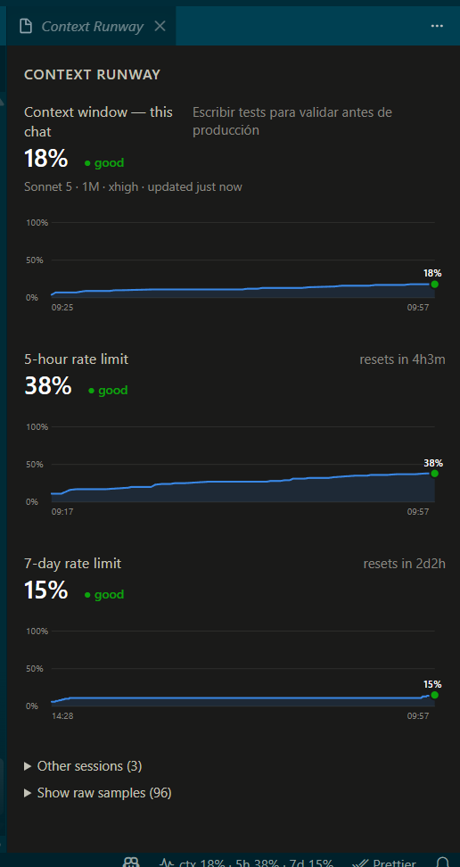
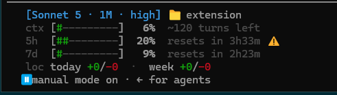

# context-runway

[](https://github.com/garcialuis23/context-runway/actions/workflows/ci.yml)
[](https://github.com/garcialuis23/context-runway/actions/workflows/codeql.yml)
[](LICENSE)

Visual tooling to see how much conversation/context "runway" you have left when working with Claude Code — tokens remaining in the current context window, and how close you are to your account's hourly/weekly usage limits.

- [`statusline/`](statusline/) — a Claude Code status line showing context window usage and rate-limit burn-rate projections.
- [`extension/`](extension/) — a companion VS Code extension with a status bar item and a webview panel with history charts, reading the same data the statusline writes.

## Screenshots

Status line, right in the terminal:


The VS Code panel, with history charts:



The `loc` row, showing lines added/removed today and this week:



## Requirements

- Node.js >= 18
- Claude Code (for the statusline)
- VS Code >= 1.85 (for the extension, optional)

> **Note:** the 5-hour/7-day rate-limit charts need at least one **terminal** `claude` session running the statusline. Claude Code's native VS Code extension (the embedded chat panel) doesn't appear to feed rate-limit data to the status line the way a terminal session does — see [`extension/README.md`](extension/README.md#known-limitation-5h7d-needs-a-terminal-claude-code-session). The context-window chart is unaffected.

## Quick start

```bash
git clone https://github.com/garcialuis23/context-runway.git
cd context-runway/statusline
npm run install-statusline
```

Then, for the richer VS Code view:

```bash
cd extension
npm run package
code --install-extension context-runway-0.1.0.vsix
```

See [`statusline/README.md`](statusline/README.md) and [`extension/README.md`](extension/README.md) for details.

## Updating

Neither piece auto-updates, and nothing is synced between machines — if you have this installed on more than one machine, repeat these steps on **each one** after pulling a new version:

```bash
git pull
```

- **statusline**: that's it. `~/.claude/settings.json` points straight at `statusline/src/index.js` in your clone, so the next Claude Code session picks up the change automatically. Only re-run `npm run install-statusline` if the update added a new setting or you see install-related errors; run `npm install` too if `package.json` changed.
- **extension**: the VS Code extension is an installed `.vsix`, not read live from the repo, so a `git pull` alone does nothing for it. Rebuild and reinstall:

  ```bash
  cd extension
  npm run package
  code --install-extension context-runway-*.vsix --force
  ```

## Contributing

Contributions are welcome via pull request — see [CONTRIBUTING.md](CONTRIBUTING.md).
`main` is protected, so all changes (including the maintainer's) go through review.
Found a security issue? See [SECURITY.md](SECURITY.md) instead of opening a public issue.

## License

[MIT](LICENSE)
