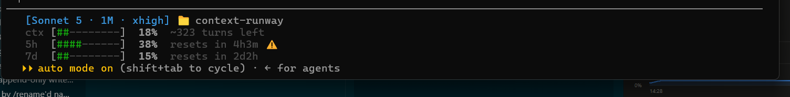

# context-runway statusline

A Claude Code status line that shows, at a glance:

- **Context runway**: how much of the current conversation's context window is used, plus an estimate of how many turns are left at the current burn rate.
- **Rate limits**: how much of your 5-hour and 7-day account usage windows are used, when each resets, and a burn-rate projection warning (⚠) if you're on pace to hit 100% before the window resets.

It reads the JSON Claude Code already sends to status line scripts (`context_window`, `rate_limits`) — no scraping, no extra API calls, no added token cost.



Requires Node.js >= 18.

## Install

```bash
git clone https://github.com/garcialuis23/context-runway.git
cd context-runway/statusline
npm run install-statusline
```

This merges a `statusLine` entry into `~/.claude/settings.json` (backing up the previous file to `settings.json.context-runway-backup` first) and leaves every other setting untouched. Restart Claude Code, or start a new session, to see it.

To remove it:

```bash
npm run uninstall-statusline
```

## Updating

`~/.claude/settings.json` points straight at `src/index.js` inside this clone, so a plain `git pull` is enough to pick up a new version — no need to re-run the installer. The exceptions: `npm install` if `package.json` changed, or `npm run install-statusline` again if the update added a new setting. If you have this installed on multiple machines, none of this syncs automatically — repeat on each one.

## How it works

- `src/index.js` is the entry point Claude Code invokes on stdin/stdout after each assistant message.
- `src/lib/history.js` persists a throttled, rolling log of usage snapshots to `~/.claude/context-runway/usage-history.jsonl` (pruned to 9 days), so trends can be computed across turns and sessions.
- `src/lib/projection.js` fits a simple slope to recent samples within the current rate-limit window and projects whether you'll exhaust it before it resets.
- `src/lib/render.js` renders the progress bars, colors (green/yellow/red at 70%/90% thresholds), and durations.

## Try it without installing

```bash
npm run demo
```

Pipes `test/fixture.json` (a mock payload matching Claude Code's documented schema) through the script so you can see the output format.

## Tests

```bash
npm test
```

Runs the automated suite (`node --test`) covering `src/lib/*` and `src/index.js`, including edge cases like malformed input, throttling, pruning, compaction detection, and rate-limit projections. Every test that touches the filesystem points `CONTEXT_RUNWAY_STATE_DIR` at a throwaway temp directory, so it never reads or writes your real `~/.claude/context-runway/usage-history.jsonl`.

## Contributing

See the [root CONTRIBUTING.md](../CONTRIBUTING.md) — PRs welcome, `main` is protected.
Found a security issue? See [SECURITY.md](../SECURITY.md) instead of opening a public issue.
